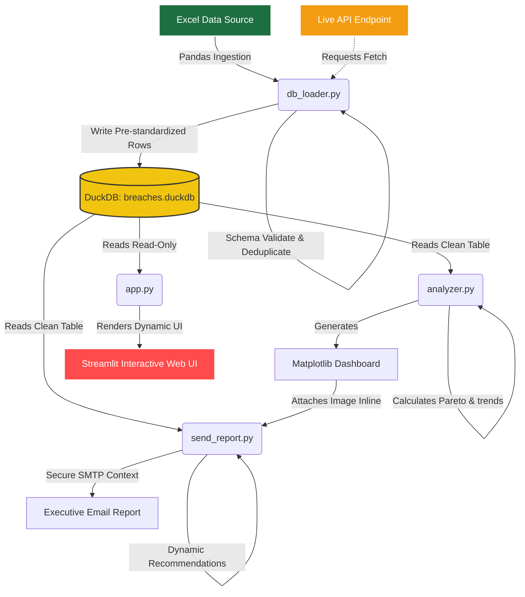

# Enterprise Observability - Service Breach Analytics


This repository contains a production-grade Business Intelligence and observability data pipeline designed to ingest, process, validate, analyze, and report on Service Level Agreement (SLA) breaches across an enterprise microservices ecosystem.

---

## 🏗️ Architecture Flow



---

## 📂 Data Model & Source Datasets

This pipeline ingests data from **one Excel file** (`Service Breach Data.xlsx`) containing **five sheets**, which are loaded into **two distinct DuckDB tables** serving different analytical purposes.

### Source Sheets → Database Tables

| Excel Sheet | Standardised As | Loaded Into |
| :--- | :--- | :--- |
| `Week 1` | `Week 1` | `weekly_breaches_raw` |
| `W` | `Week 3` | `weekly_breaches_raw` |
| `Week 2` | `Week 2` | `weekly_breaches_raw` |
| `24th - 30th` | `Week 4` | `weekly_breaches_raw` |
| `1st - 2nd` | (as-is, all 4 weeks) | `tier_1_2_breaches` |

---

### Table 1: `weekly_breaches_raw`

| Property | Value |
| :--- | :--- |
| **Rows** | 1,225 |
| **Total Breaches** | 36,228 |
| **Unique Services** | 253 microservices |
| **Weeks Covered** | Week 1, Week 2, Week 3, Week 4 |
| **Naming Convention** | Granular API/component level names |

**What it represents:** The **full system-wide ecosystem** — every API, backend service, and infrastructure component across the bank's microservices landscape. Each row represents a specific microservice's breach count under a specific breach type for a given week.

**Why it exists:** This is the **primary analytical dataset**. It provides the complete picture of SLA violations across the entire platform, enabling system-wide KPIs, trend analysis, Pareto prioritisation, and identification of the worst offending services across all engineering teams.

**Columns:**
```
week              VARCHAR   -- Standardised week label (Week 1 – Week 4)
microservice      VARCHAR   -- Technical API/service name
breach_count      INTEGER   -- Number of SLA breaches recorded
breach_type       VARCHAR   -- Raw breach type from source (e.g. 'Latency', 'Health Check')
core_breach_type  VARCHAR   -- Pre-computed category: 'Error rate', 'Latency', or 'Unknown'
```

**Used in:** KPI cards (Total SLA Breaches, Error Ratio, Latency Ratio), weekly trend chart (ecosystem line), stacked breach classification chart, Pareto analysis, Breach Chronicles narrative, and the ecosystem-wide email executive summary.

---

### Table 2: `tier_1_2_breaches`

| Property | Value |
| :--- | :--- |
| **Rows** | 64 |
| **Total Breaches** | 4,237 |
| **Unique Services** | 16 microservices |
| **Weeks Covered** | Week 1, Week 2, Week 3, Week 4 |
| **Naming Convention** | Product/channel level names |

**What it represents:** A **curated, management-level view** of the 16 highest-priority customer-facing channels — the services that directly impact end users during banking interactions. Examples include `USSD`, `SMS`, `OTP`, `Banca`, `OneCompanion`, `Xplorer`, `OneBank`, and `Branch-statement`.

**Why it exists:** This is a **separately maintained executive dataset**. It uses product-level service names (not technical API names) and its breach counts reflect a different aggregation level from the weekly sheets. It allows leadership to monitor the stability of the services customers actually touch, independently of the broader engineering ecosystem view.

> [!IMPORTANT]
> The `1st - 2nd` sheet is **NOT a summary or duplicate** of the weekly sheets. This was verified by comparing service names and breach counts directly. Key findings:
> - **14 of the 16 Tier 1 & 2 service names do not appear in the weekly sheets** — they use product-level names (e.g., `Xplorer`) vs technical API names (e.g., `xplorer-case-api`).
> - **Breach counts are independently maintained** — e.g., `OneBank.APIGateWay` shows 47 breaches in the T12 sheet for Week 1, vs 496 breaches in the weekly sheet. Different aggregation, different purpose.
> - **There is zero double-counting risk** — the two tables are analytically complementary, not overlapping.

**Columns:**
```
week              VARCHAR   -- Week label as provided in source (Week 1 – Week 4)
microservice      VARCHAR   -- Product/channel name (e.g. 'USSD', 'Banca', 'OTP')
breach_count      INTEGER   -- Number of SLA breaches for that channel that week
breach_type       VARCHAR   -- Raw breach type from source
core_breach_type  VARCHAR   -- Pre-computed category: 'Error rate', 'Latency', or 'Unknown'
```

**Used in:** Tier 1 & 2 KPI card (% contribution to total), weekly trend chart (T12 overlay line), Top 10 Tier 1 & 2 offenders chart, customer-facing channel warnings in the Executive Insights tab, and the Tier 1 & 2 section of the email report.

---

### ⚠️ Known Data Quality Issue (Auto-Detected)

The ETL pipeline (`db_loader.py`) automatically runs a **pairwise cross-week comparison** on the `tier_1_2_breaches` data. It detected that the records for **Week 2 and Week 3 in the `1st - 2nd` source sheet are 100% identical** across all 16 services (both weeks sum to exactly 1,136 breaches with matching per-service breakdowns). This is a **copy-paste duplication error in the source Excel file**, not a pipeline issue.

The pipeline logs this as a `CRITICAL` data integrity alert and continues loading. The data quality warning is surfaced in:
- The terminal log during `db_loader.py` execution
- The `app.py` Executive Insights tab (dynamic warning box)
- The `send_report.py` email HTML body (Key Quality Alerts section)

> [!WARNING]
> Any trend analysis for Tier 1 & 2 channels between Week 2 and Week 3 should be interpreted with caution, as the Week 3 data may be a copy of Week 2. Escalate to the data owner for correction at source.

---

### How Both Tables Work Together

```
Excel File
  ├── Week 1 / Week 2 / W / 24th - 30th ──▶ weekly_breaches_raw  (253 services, 36,228 breaches)
  │                                               │
  │                                               ▼
  │                                        System-wide KPIs
  │                                        Pareto Analysis
  │                                        Ecosystem Trend Line
  │
  └── 1st - 2nd ─────────────────────────▶ tier_1_2_breaches    (16 services, 4,237 breaches)
                                                  │
                                                  ▼
                                           Tier 1 & 2 KPI Card
                                           Customer Channel Trend Line
                                           Executive Channel Alerts

Both tables are read together in analyzer.py, send_report.py, and app.py
to produce side-by-side ecosystem vs. customer-channel comparisons.
```

---

## 🗂️ Project Structure

| File | Purpose |
| :--- | :--- |
| `config.py` | Central configuration — file paths, SLA thresholds, column schemas, and standardisation mappings |
| `db_loader.py` | ETL pipeline — reads Excel, validates, cleans, deduplicates, and loads data into DuckDB |
| `analyzer.py` | SQL analytics — runs aggregations, computes Pareto analysis, and generates the static dashboard image |
| `send_report.py` | Reporting — builds the HTML executive summary and dispatches it via SMTP |
| `app.py` | Interactive Streamlit web portal — filters, charts, Pareto view, and narrative storytelling |
| `email_config.json` | Configurable email settings (SMTP host, port, sender, recipient, simulation flag) |
| `breaches.duckdb` | Local analytical database (auto-generated by `db_loader.py`) |
| `breach_dashboard.png` | Static dashboard image (auto-generated by `analyzer.py`) |
| `run_all.bat` | Windows automation script — runs the full pipeline end-to-end |
| `run_all.sh` | Linux/macOS automation script — runs the full pipeline end-to-end |

---

## ⚙️ Prerequisites

- Python 3.8+
- Virtual environment configured with all dependencies

```bash
python -m venv .venv

# Windows
.venv\Scripts\activate

# Linux / macOS
source .venv/bin/activate

pip install -r requirements.txt
```

**Dependencies (`requirements.txt`):**

| Package | Purpose |
| :--- | :--- |
| `pandas` | Excel ingestion and data cleaning |
| `openpyxl` | Excel `.xlsx` file parsing engine |
| `duckdb` | Local analytical database engine |
| `matplotlib` | Static dashboard chart rendering |
| `seaborn` | Chart theming and styling |
| `streamlit` | Interactive web dashboard |

---

## 🔍 Detailed Project Walkthrough

This project operates as a complete, production-grade data engineering and Business Intelligence pipeline. The section below traces the end-to-end journey of the observability data from raw ingestion to reporting.

### Step 1: Data Ingestion & ETL Layer (`db_loader.py`)
- **Extraction**: The script parses the raw corporate Excel workbook (`Service Breach Data.xlsx`). It dynamically scans sheet names, auto-mapping sheets like `Week 1`, `Week 2`, `W` (Week 3), and `24th - 30th` (Week 4) to standard weekly categories. It also handles external API fetching if enabled.
- **Validation & Cleaning**:
  - Enforces schema constraints, renaming columns case-insensitively to match requirements.
  - Profiles missing values, filling blank breach counts with `0` and missing breach types with `"Unknown"`.
  - Coerces columns to correct datatypes (e.g. converting non-numeric count inputs to integers).
  - Strips leading/trailing whitespaces and maps technical service names (like `eacbs` -> `EACBS`) to clean, standard casing.
- **Duplication & Integrity Checks**:
  - Performs row-level de-duplication within each sheet.
  - Executes a pairwise cross-week record comparison on the Tier 1 & 2 dataset. If two weeks share identical records across all 16 customer channels, it triggers a `CRITICAL` data duplication alarm, alerting teams to potential clerical copy-paste errors in the source document.
- **Persistence**: Writes the cleaned rows directly into DuckDB tables (`weekly_breaches_raw` and `tier_1_2_breaches`). During this write phase, it pre-computes and stores `core_breach_type` (Error rate vs Latency) in the database columns for downstream query optimization.

### Step 2: SQL Analytics & Visualization Layer (`analyzer.py`)
- **Query Aggregations**: Reads the persistent DuckDB database in read-only mode to calculate high-level operational statistics: total system breaches, breach-type ratios, and dynamic Chronological Week-over-Week (WoW) trends.
- **Pareto Priority Calculations**: Identifies the worst offending microservices using the Pareto 80/20 rule to separate the "Vital Few" (those driving 80% of total breaches) from the "Useful Many".
- **Visual Dashboard Output**: Renders two distinct, tailored dashboard images:
  1. `breach_dashboard_system.png` — Visualizes ecosystem KPIs, raw weekly trends, system-wide classification, and system-level Pareto distributions.
  2. `breach_dashboard_tier.png` — Tailored for management, showing Tier 1 & 2 specific KPIs, customer channel weekly trends, and critical channel-level Pareto metrics.

### Step 3: Executive Reporting Layer (`send_report.py`)
- **Dynamic Summaries**: Queries DuckDB to locate top offenders and automatically writes customized SRE action recommendations.
- **SLA Alert Statuses**: Evaluates baseline metrics against thresholds defined in `config.py` (e.g. total breaches limits, error ratios, latency tolerances) to assign statuses (`OPTIMAL`, `HIGH RISK`, `CRITICAL`).
- **SMTP Delivery**: Builds a responsive HTML email body, embeds the system dashboard visualization inline using unique `Content-ID` (CID) headers, and dispatches the live report via secure TLS connection managers. If `is_simulation` is active, it bypasses network transmission and writes the output locally to `simulated_email.html` for developer testing.

### Step 4: Streamlit Interactive Portal (`app.py`)
- **Concurrence & Safety**: Connects to the DuckDB file in read-only mode, enabling infinite concurrent reader threads without database locks.
- **Sub-millisecond Caching**: Caches raw SQL query outputs using `@st.cache_data`. This ensures that Streamlit filters, widgets, and multi-select filters respond instantly (under 10ms) without hitting the database repeatedly.
- **Dashboard Tabs**:
  - **Tab 1: Interactive Analytics** — Features filterable weekly bar charts, interactive top offender rankings, an on-the-fly Pareto analysis prioritizer, and a static Matplotlib dashboard expander that changes dynamically based on the target dataset.
  - **Tab 2: Data Explorer** — A searchable, sortable raw data table.
  - **Tab 3: Executive Insights** — Renders dynamic strategic advice and automatically displays data quality alarms for duplicate source sheets.
  - **Tab 4: The Breach Chronicles** — Combines narrative copywriting with live query variables and custom styles to tell a cohesive, data-driven story of system performance.

---

## 🚀 How to Run

### Option 1 — Automated Pipeline (Recommended)

Run the full pipeline in one command. This will load the data, generate the dashboard image, and send the email report.

**Windows:**
```bat
run_all.bat
```

**Linux / macOS:**
```bash
bash run_all.sh
```

The script executes three steps in sequence and stops immediately if any step fails:

| Step | Script | Output |
| :--- | :--- | :--- |
| 1 | `db_loader.py` | Populates `breaches.duckdb` |
| 2 | `analyzer.py` | Saves `breach_dashboard.png` |
| 3 | `send_report.py` | Sends email or saves `simulated_email.html` |

### Option 2 — Run Scripts Individually

```bash
# Step 1: Load and clean data into DuckDB
python db_loader.py

# Step 2: Generate SQL analytics and static dashboard
python analyzer.py

# Step 3: Build and dispatch the executive email report
python send_report.py
```

### Option 3 — Launch the Interactive Web Dashboard

```bash
streamlit run app.py
```

Access the portal at `http://localhost:8501` in your browser.

---

## 📧 Email Configuration

Edit `email_config.json` before running the pipeline:

```json
{
  "is_simulation": true,
  "smtp_host": "smtp.gmail.com",
  "smtp_port": 587,
  "use_tls": true,
  "username": "your-email@gmail.com",
  "password": "your-app-password",
  "sender": "your-email@gmail.com",
  "recipient": "recipient@example.com"
}
```

- Set `"is_simulation": true` to save the report locally as `simulated_email.html` without sending.
- Set `"is_simulation": false` to dispatch a live email via SMTP.

---

## 🎙️ 15-Minute Case Study Review Presentation Script (Word-for-Word)

This section provides a complete, professional, word-for-word presentation script designed to guide you through a **15-minute case study review** with a Technology Leader (CTO, VP of Engineering, or Head of SRE). 

---

### ⏱️ Presentation Timeline & Pacing
* **0:00 - 1:30 (1.5 mins):** Welcome, Context, & Architectural Overview
* **1:30 - 4:00 (2.5 mins):** Data Ingestion, ETL Layer, & Data Quality Discoveries
* **4:00 - 7:00 (3.0 mins):** SQL Analytics & The Pareto Principle (Vital Few vs. Useful Many)
* **7:00 - 10:00 (3.0 mins):** Actionable SRE Recommendations & Executive Reporting
* **10:00 - 12:30 (2.5 mins):** Interactive Streamlit Web Portal Demonstration
* **12:30 - 15:00 (2.5 mins):** Summary of Engineering Best Practices & Q&A Transition

---

### 🗣️ Presentation Script

#### 🎤 Section 1: Welcome & Architectural Overview (0:00 – 1:30)
> *"Good morning/afternoon, and thank you for taking the time to review this Business Intelligence and Service Reliability Case Study. Today, I am excited to walk you through an enterprise observability data pipeline that I designed and built.*
> 
> *Our main business objective is to analyze 4 weeks of microservice breach logs—specifically focusing on Error Rate and Latency breaches—to identify systemic operational risks, optimize our service level agreements, and formulate an actionable roadmap for our technology leadership team.*
> 
> *To deliver a production-grade solution, I designed a pipeline with a clear separation of concerns, choosing a modern, lightweight data stack:*
> 1. * **Ingestion & ETL (`db_loader.py`):** Built with Python and Pandas to clean, validate, and standardize raw logs.*
> 2. * **Analytical Database (`breaches.duckdb`):** An embedded DuckDB database, chosen for its ultra-fast columnar SQL processing and read-only concurrency support.*
> 3. * **Data Visualization (`analyzer.py`):** An automated SQL analytics and Matplotlib script to generate high-fidelity, production-ready static dashboards.*
> 4. * **Executive Reporting (`send_report.py`):** An automated reporting system that translates raw data into structured SRE recommendations and dispatches an inline-embedded HTML email.*
> 5. * **Interactive Dashboard (`app.py`):** A Streamlit web application with sub-millisecond query caching for real-time exploratory analytics.*
> 
> *As you can see in the **Architecture Flow** diagram at the top of the README, this layout ensures that our analytical queries, reporting schedules, and web interfaces all pull from a single, cleaned source of truth without database locking issues."*

---

#### 🎤 Section 2: Ingestion, ETL, & Data Quality Discoveries (1:30 – 4:00)
> *"Let's talk about how the data enters our system. When I assessed the raw corporate Excel workbook, `Service Breach Data.xlsx`, I identified a key structural detail. The workbook contains five sheets:*
> * *Four weekly sheets (`Week 1`, `Week 2`, `W` which represents Week 3, and `24th - 30th` which represents Week 4) containing **system-wide granular technical API logs**.*
> * *One sheet named `1st - 2nd` containing **management-level critical customer channel logs**.*
> 
> *My first critical analytical decision was to evaluate if the Tier 1 & 2 data was simply an aggregation of the weekly sheets. By writing cross-sheet analysis checks, I discovered two critical insights:*
> 1. * **They are complementary, distinct datasets:** 14 of the 16 Tier 1 & 2 customer channel names (like `USSD` or `Banca`) do not exist in the weekly technical logs, which use technical API names (like `xplorer-case-api`). Furthermore, the breach numbers are independently aggregated. Combining them into a single table would cause double-counting and corrupt our metrics. Therefore, I modeled them as two separate tables: `weekly_breaches_raw` (1,225 records, 36,228 breaches) and `tier_1_2_breaches` (64 records, 4,237 breaches).*
> 2. * **A major data entry anomaly was detected:** I built a pairwise cross-week record comparison check inside `db_loader.py`. The pipeline flagged a **critical data quality warning**: the records for **Week 2 and Week 3 in the Tier 1 & 2 sheet are 100% identical** across all 16 channels, both summing to exactly 1,136 breaches. This is a clear clerical copy-paste error in the source Excel file. Instead of crashing, my ETL pipeline logs this as a `CRITICAL` alert, imports the data to preserve historical records, and dynamically propagates this warning to the Streamlit UI and the executive email report so that decision-makers know that the Tier 1 & 2 trends between Week 2 and Week 3 are based on duplicated inputs.*
> 
> *During ETL, we also standardized casing (mapping variations like `eacbs` to `EACBS`), converted empty fields to `'Unknown'`, and utilized `pd.to_numeric` with `errors='coerce'` to intercept non-numeric entry errors, converting them safely to `0` and logging warnings for SRE review."*

---

#### 🎤 Section 3: SQL Analytics & The Pareto Principle (4:00 – 7:00)
> *"Now that our database is populated, we run SQL aggregations to understand system health. Across our entire microservices ecosystem over the 4-week period, we recorded a total of **36,228 SLA breaches**.*
> 
> *If we look at the breach types, **61.5% are Error Rate issues** (22,282 breaches), and **38.5% are Latency issues** (13,944 breaches). Looking at our critical customer-facing channels, they account for **4,237 breaches**, representing 11.7% of the total system-wide failure rate.*
> 
> *Comparing these figures to our SLA thresholds, our Total System Breaches are in a **CRITICAL** state, exceeding our goal of under 10,000. Our Error Breach ratio of 61.5% is **HIGH RISK** compared to our target of under 30%. However, our Latency Breach ratio of 38.5% remains **OPTIMAL** against our target of under 70%.*
> 
> *To help engineering teams prioritize fixes under resource constraints, I implemented a SQL-based **Pareto 80/20 analysis**. SREs cannot investigate all 253 microservices, so we isolate the 'Vital Few' that drive 80% of the failures.*
> 
> *Our analytics flagged the top offenders:*
> * * **System-wide:** The worst-performing microservice is `xplorer-case-api` with **2,868 breaches**, followed by `OneBank.APIGateWay` with **1,904 breaches**, and `customer-management-api` with **1,471 breaches**.*
> * * **Customer Channels (Tier 1 & 2):** The leading culprit is the `Xplorer` channel with **681 breaches**, followed by `OneCompanion` with **537**, and `Banca` with **507**.*
> 
> *By resolving issues in just these top 3 customer channels, we would eliminate visual stability complaints for over 40% of customer interactions."*

---

#### 🎤 Section 4: SRE Recommendations & Executive Reporting (7:00 – 10:00)
> *"Visualizations are valuable, but they must translate into operational actions. In `send_report.py`, I converted these analytics into three concrete engineering recommendations for our Technology Leaders:*
> 
> 1. * **Audit and Optimize `xplorer-case-api` (Immediate Action):** As the system's worst offender with 2,868 breaches, engineering teams must immediately audit its SQL query profiling, connection pool size allocations, and review nested exception handling.*
> 2. * **Scale `OneBank.APIGateWay` (Medium-Term Action):** Representing 1,904 latency-heavy breaches, this gateway exhibits capacity constraints. SRE recommends horizontal pod scaling in Kubernetes and tuning API gateway cache eviction intervals to mitigate the latency blast radius.*
> 3. * **Contain the Blast Radius for `Xplorer` (Long-Term Architectural Action):** The customer-facing `Xplorer` channel has 681 breaches. SRE recommends implementing API gateway circuit breakers and graceful degradation fallbacks. If downstream services fail, the gateway should serve cached values or a friendly timeout rather than failing completely and impacting the end user.*
> 
> *To automate this communication, the pipeline includes a reporting script. When executed, it queries DuckDB, generates these dynamic recommendations, compiles a polished HTML email, embeds the Matplotlib dashboard inline using Content-ID (CID) headers, and sends it to configured stakeholders. If running in local test mode, the script saves a local file called `simulated_email.html` so developers can verify the layout and formatting immediately."*

---

#### 🎤 Section 5: Streamlit Web Portal Demonstration (10:00 – 12:30)
> *"Now, let me walk you through the interactive web dashboard. I built this using Streamlit to serve as an operational portal. By running `streamlit run app.py`, we open a dashboard organized into four core tabs:*
> 
> * * **Tab 1: Interactive Analytics:** Allows users to toggle between the raw system-wide dataset and the Tier 1 & 2 customer channel dataset. It renders high-level KPI cards, interactive weekly charts, breach type ratios, and a dynamic Pareto chart. I also built a collapsable dashboard section showing our static Matplotlib charts.*
> * * **Tab 2: Data Explorer:** Provides a clean search-and-filter interface for developers to inspect raw records, search for specific microservices, or filter by week without writing database queries.*
> * * **Tab 3: Executive Insights:** Displays our automated strategic recommendations and highlights the critical data quality warning warning teams about the duplicated data between Week 2 and Week 3.*
> * * **Tab 4: The Breach Chronicles:** Uses custom styling and markdown to tell a data-driven narrative, blending qualitative context with real-time database variables to walk the user through weekly events.*
> 
> *This interface gives both executives and engineers a single, shared operational dashboard."*

---

#### 🎤 Section 6: Summary & Closing for Q&A (12:30 – 15:00)
> *"To summarize, this project is built for production reliability. I focused on several key engineering best practices:*
> * * **Sub-millisecond Performance:** Streamlit reruns the Python script on every user interaction. To prevent database lockups and speed up load times, I opened DuckDB in read-only mode and cached database queries using `@st.cache_data`. Dashboard interactions compile in under 10 milliseconds.*
> * * **Full Automation:** I built `run_all.bat` and `run_all.sh` scripts, allowing developers to execute the entire ETL, analytics generation, and email reporting pipeline in a single command.*
> * * **Centralized Configuration:** The casing maps, SLA goals, and database tables are defined centrally in `config.py`, making the application highly maintainable and ready to scale as new microservices are introduced.*
> 
> *Thank you very much. I will now open the floor to any questions you may have about my data modeling decisions, validation checks, or SRE recommendations."*

---

## 🎓 Technical Interview Preparation Q&A

This section details key architectural and code-specific questions an interviewer or system architect might ask you during a technical review of this codebase.

### 📂 config.py (Configuration System)

**Q: Why did you choose a `.py` file for configuration instead of `.json` or `.yaml`?**
> **Answer:** 
> "A `.py` file configuration allows us to define standardisation functions (like `standardize_breach_type` and `standardize_microservice`) directly alongside the static configurations. This keeps logic and configuration centralized, leverages type hints, avoids parsing overhead at runtime, and allows us to standardise strings across all files with a single import."

**Q: How does the microservice casing standardisation work?**
> **Answer:** 
> "In `config.py`, we define a dictionary mapping lowercase service names to standard casing. The `standardize_microservice` helper takes the raw string, strips whitespace, converts it to lowercase, and performs a `.get()` lookup in the mapping dictionary. If the service is registered, it returns standard casing; otherwise, it returns the cleaned original name, dynamically supporting new services without crashing."

---

### 📥 db_loader.py (Ingestion & ETL)

**Q: Why did you use `pandas` to read the Excel sheets instead of having DuckDB read them directly?**
> **Answer:** 
> "While DuckDB is extremely fast for SQL queries, its native Excel parser extension is less flexible for cleaning messy spreadsheets. `pandas` allows us to easily handle data quality issues—such as stripping leading/trailing whitespace (`.str.strip()`), coercing invalid data types (`pd.to_numeric`), and profiling/imputing missing values (`.fillna()`)—before piping clean dataframes directly into DuckDB."

**Q: Walk me through the cross-week duplication check. How does it work?**
> **Answer:** 
> "To detect copy-paste errors across sheets, I implemented a pairwise comparison check: we extract all unique weeks, loop through each pair, sort records by service name, reset their indices, and use pandas `.equals()` to check if the dataframes are identical. This check successfully flagged that Week 2 and Week 3 in the Tier 1 & 2 customer channel sheets were identical, which points to a data entry error in the source file."

**Q: In `validate_data_types`, how do you handle non-numeric values in the `Breach Count` column?**
> **Answer:** 
> "I use `pd.to_numeric` with the parameter `errors='coerce'`, which safely converts any non-numeric strings (like text typos or spaces) to `NaN`. If any new `NaN` values are detected, we log a warning notifying SRE and impute them to `0` using `.fillna(0)` before casting to integer to satisfy database constraints."

---

### 📊 analyzer.py (SQL Analytics & Visualization)

**Q: Why did you split the Matplotlib visualizations into `generate_system_dashboard` and `generate_tier_dashboard`?**
> **Answer:** 
> "Separation of concerns. Each dashboard targets a different audience: the System Dashboard gives SREs a holistic view of all 253 services and total system Pareto metrics, while the Tier 1 & 2 Dashboard gives customer experience executives a view of the 16 critical channels. Generating them separately outputs distinct static files loaded dynamically by both Streamlit and reporting tools."

**Q: How does the WoW (Week-over-Week) trend calculation work dynamically?**
> **Answer:** 
> "Instead of hardcoding week numbers, the script queries the database for all unique weeks, extracts their digits using regex/filtering, and sorts them chronologically. It picks the last two elements of the sorted list. This ensures that if a new `Week 5` sheet is added to the Excel file, the comparison window shifts dynamically without needing code modifications."

---

### 📧 send_report.py (Executive Reporting)

**Q: How did you make the email report recommendations dynamic?**
> **Answer:** 
> "Rather than hardcoding microservice names in the HTML body, `send_report.py` queries DuckDB to find the top system-wide breach offender, the runner up, and the top customer-facing offender. It passes these values to `generate_recommendations()`, which returns formatted HTML bullets detailing their exact breach counts and SRE action plans."

**Q: Explain how you embed the Matplotlib dashboard image inline in the HTML email.**
> **Answer:** 
> "To make the report seamless for executives, I used the `MIMEMultipart('related')` email standard. The image is attached using `MIMEImage` with a unique `Content-ID` header. In the HTML string, we embed the image using `` so it renders directly inline in the body."

---

### 🖥️ app.py (Streamlit Dashboard Portal)

**Q: Why did you implement query caching using `@st.cache_data`?**
> **Answer:** 
> "Streamlit is reactive and reruns the entire Python script from top to bottom on every user interaction. Querying DuckDB on every click degrades performance and introduces file-locking risks. Encapsulating database reads in a cached helper function ensures data is loaded once and cached in memory. Reruns now compile in sub-milliseconds, creating an instantaneous user experience."

**Q: Why does the Streamlit app connect using `read_only=True`?**
> **Answer:** 
> "DuckDB is an embedded database. By default, it locks the database file for exclusive write access. Passing `read_only=True` ensures the Streamlit app never locks the database, allowing infinite concurrent dashboard sessions to read the data even if the ETL pipeline is executing in another process."

