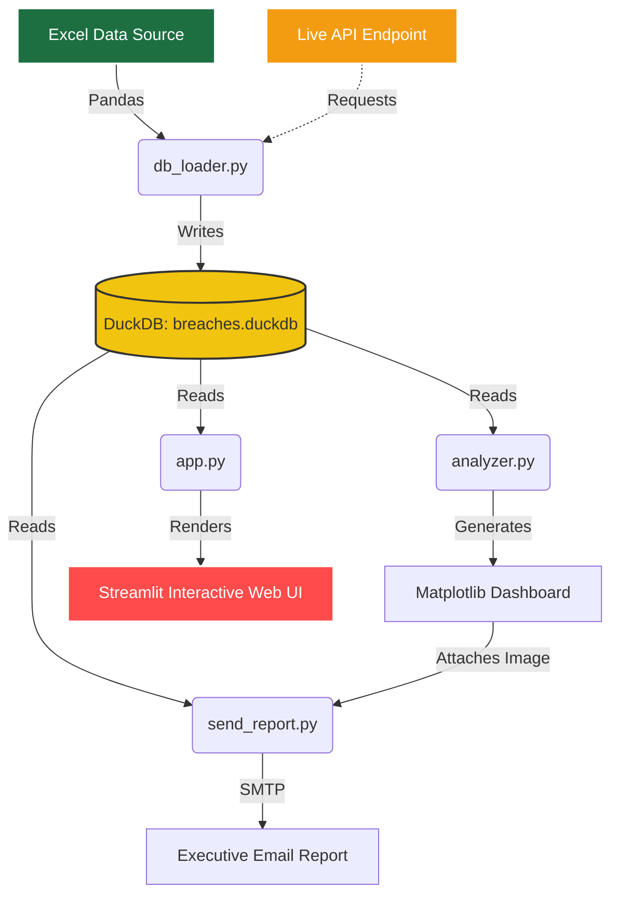

# Enterprise Observability - Service Breach Analytics


This repository contains a complete Business Intelligence and observability data pipeline designed to ingest, process, visualize, and report on Service Level Agreement (SLA) breaches across a microservices ecosystem.

##  Architecture Flow



##  Overview

The system takes raw Excel data (and optionally live API metrics) containing weekly breach counts for various microservices, cleans and standardizes the data, and loads it into a fast analytical database (DuckDB). From there, it generates both static visual dashboards and a fully interactive web application, alongside an automated executive email reporting system.

##  Project Structure & File Descriptions

The project is divided into distinct Python scripts handling different stages of the data pipeline:

### 1. `db_loader.py` (Data Ingestion & Cleaning)
- **What it does:** Extracts data from the source Excel file, fetches external API metrics, and loads everything into DuckDB.
- **How it works:** 
  - Reads individual weekly sheets and the Tier 1 & 2 channel sheet using `pandas`.
  - Cleans whitespace from service names, standardizes casing (e.g., ensuring "eacbs" becomes "EACBS"), and handles missing breach types.
  - Features an **API Integration module** (`fetch_api_data`) that uses the `requests` library to fetch live data from external observability dashboards (like Grafana). This is currently mocked but is fully production-ready.
  - Creates two tables in the local `breaches.duckdb` file: `weekly_breaches_raw` and `tier_1_2_breaches`.

### 2. `analyzer.py` (SQL Analytics & Visualization)
- **What it does:** Performs SQL aggregations and generates a static visual dashboard.
- **How it works:**
  - Connects to the DuckDB database.
  - Runs SQL queries to compute weekly trends, calculate the split between "Error rate" and "Latency" breaches, and identify the top 10 offending microservices globally and in Tier 1 & 2.
  - Uses `matplotlib` and `seaborn` to render a 4-part dashboard grid (KPI cards, weekly trends, breach type breakdown, and top offenders).
  - Saves the resulting dashboard as `breach_dashboard.png`.

### 3. `send_report.py` (Automated Reporting)
- **What it does:** Generates an HTML executive summary and sends it via email.
- **How it works:**
  - Queries the database for high-level KPIs and top offenders.
  - Constructs a responsive HTML email body injecting the data into a template.
  - Reads `email_config.json` for SMTP credentials.
  - Attaches the `breach_dashboard.png` image inline.
  - Sends the email using Python's `smtplib` (or saves a local `simulated_email.html` if `is_simulation` is set to `true`).

### 4. `app.py` (Interactive Web Dashboard)
- **What it does:** Provides an interactive UI for exploring the data and reading analytical narratives.
- **How it works:**
  - Built with Streamlit, it connects to DuckDB in read-only mode to prevent file locks.
  - **Tab 1:** Provides interactive bar charts for weekly distributions and top offenders, with filters for weeks and breach types. Includes a toggle to view the static dashboard image.
  - **Tab 2:** A searchable raw data table.
  - **Tab 3:** Static executive insights and strategic recommendations based on the data.
  - **Tab 4 (The Breach Chronicles):** Computes data on the fly to generate a dynamic, narrative-driven report styled with custom CSS for maximum readability.

### 5. `run_all.sh` (Pipeline Automation)
- **What it does:** A wrapper shell script to run the entire data pipeline sequentially.
- **How it works:** 
  - Executes `db_loader.py`, then `analyzer.py`, then `send_report.py`.
  - Checks for exit codes at each step and halts the pipeline if a failure occurs.

---

##  Implementation Procedure

### Prerequisites
- Python 3.x
- Virtual environment (`.venv`) configured with dependencies: `streamlit`, `duckdb`, `pandas`, `matplotlib`, `seaborn`, `openpyxl`, `requests`.

### Execution Steps
1. **Configure Email (Optional):** Edit `email_config.json` to provide your SMTP credentials. Set `"is_simulation": false` if you want to send a real email.
2. **Run the Pipeline:** Execute the shell script to load data, generate the static dashboard, and build the email report.
   ```bash
   source .venv/bin/activate
   bash run_all.sh
   ```
3. **Launch the Web Dashboard:** Start the Streamlit application to interact with the data.
   ```bash
   streamlit run app.py
   ```
   Access the dashboard in your web browser at `http://localhost:8501`.

---

## 📊 Data Model

The DuckDB database (`breaches.duckdb`) contains two primary tables:
- **`weekly_breaches_raw`**: All system microservices. Columns: `week`, `microservice`, `breach_count`, `breach_type`.
- **`tier_1_2_breaches`**: Filtered subset of critical channels. Columns: `week`, `microservice`, `breach_count`, `breach_type`.

Breach types are further mapped into core categories within `app.py` and `analyzer.py`:
- **Error rate:** Error rate, Availability, Health Check, Failed Count, Failure Rate & Failed Count.
- **Latency:** Latency, Consumer Lag, Pending Count, Pending Rate & Pending Count, Frozen Jobs, Unsynced Count, High Disk Usage on D:.
- **Unknown:** Any other unmapped types.

---

##  Interview Preparation (Q&A)

If you are asked to walk through this project in an interview, here are common questions and how to answer them:

**Q: Why did i choose DuckDB over pandas or SQLite for this project?**
> A: While `pandas` is great for simple scripts, loading the data into DuckDB provides a scalable analytical backend. DuckDB is highly optimized for analytical (OLAP) queries, meaning grouping and aggregating thousands of rows is exceptionally fast. It also acts as a clean persistence layer so that the heavy lifting (loading and parsing Excel files) only happens once, rather than every time the Streamlit dashboard reloads.

**Q: How did you handle the messy/inconsistent data from the raw Excel file?**
> A: The `db_loader.py` script acts as an ETL (Extract, Transform, Load) pipeline. It handles several issues:
> - **Whitespace:** It strips trailing spaces from microservice names.
> - **Inconsistent Casing:** It standardizes names (e.g., forcing "eacbs" to "EACBS").
> - **Missing Values:** Blank "Breach Type" cells are filled with the string `"Unknown"` to prevent null-reference errors downstream.

**Q: Why do you categorize some breach types as "Unknown"?**
> A: To make the visualizations (like the bar charts and KPI metrics) readable, we group dozens of highly specific breach descriptions into two main buckets: "Error rate" (things breaking) and "Latency" (things running slow). The "Unknown" bucket is a safety net. If a cell was blank in the original spreadsheet, or if a completely new, unrecognized breach type appears in the data, it gets bucketed as "Unknown" so the data is not lost or silently dropped.

**Q: Can you explain the SQL syntax you used to categorize these breach types, specifically the use of keywords like `CASE`, `END`, and `AS`?**
> A: Absolutely! In `analyzer.py`, I used a conditional SQL statement that looks like this:
> ```sql
> SELECT 
>     CASE 
>         WHEN breach_type IN ('Health Check', 'Failed Count') THEN 'Error rate'
>         WHEN breach_type IN ('Consumer Lag', 'Pending Count') THEN 'Latency'
>         ELSE 'Unknown'
>     END AS core_breach_type
> ```
> - **`CASE ... WHEN ... THEN`**: This works exactly like an `if/elif` statement in Python. It checks the value of the raw `breach_type` column and assigns it to a bucket.
> - **`ELSE`**: This handles the fallback (anything not matched above gets labelled 'Unknown').
> - **`END`**: This keyword simply tells the database engine that the conditional `CASE` logic is finished.
> - **`AS core_breach_type`**: This is an **alias**. It tells the database to take the result of that entire `CASE...END` logic and output it as a brand new, neatly named column called `core_breach_type` so it's easy to read in Python and plot on a chart.

**Q: Can this system handle live data, or is it strictly tied to Excel?**
> A: I built the system to be future-proof. While the primary data source is currently Excel, I've already implemented a `fetch_api_data()` module inside `db_loader.py`. It uses the `requests` library to fetch JSON payloads from external observability APIs (like Grafana). This data gets parsed and appended directly into the DuckDB database alongside the Excel data, meaning the dashboard can easily display hybrid (historical + live) data.

**Q: How do you prevent file locking issues since both `analyzer.py` and `app.py` use the same database?**
> A: DuckDB allows only one process to read/write to a database file at a time by default. To solve this, both the dashboard (`app.py`) and the analyzer script connect to the database using `read_only=True` (`duckdb.connect(db_file, read_only=True)`). This allows multiple scripts to query the database concurrently without throwing lock errors. The only script that requires write access is `db_loader.py`, which runs first when no other scripts are active.

**Q: Why did you separate the Matplotlib dashboard (`analyzer.py`) from the Streamlit app (`app.py`)?**
> A: Separation of concerns. The `analyzer.py` script serves as a batch job that can run on a schedule (e.g., via a cron job) to generate static assets (`breach_dashboard.png`) and feed the automated email system without needing a web server running. `app.py` serves exclusively as the interactive, user-facing layer. The Streamlit app can still embed the static dashboard generated by the analyzer.

**Q: How does `send_report.py` manage to embed the dashboard image directly into the email body, rather than as an annoying attachment?**
> A: To make the email look like a seamless professional report, the script uses the `MIMEMultipart('related')` email standard. It attaches the image (`breach_dashboard.png`) using the `MIMEImage` class and assigns it a unique `Content-ID` (in this case, `<breach_dashboard>`). In the raw HTML string, the image is rendered using ``. This guarantees the image renders inline natively across all major email clients (Outlook, Gmail, Apple Mail) without requiring the user to download an attachment.

**Q: Why does `send_report.py` query the database again to get its metrics? Couldn't `analyzer.py` just pass the numbers to it?**
> A: It queries DuckDB directly to maintain strict **separation of concerns**. If `analyzer.py` passed variables to the reporting script, they would be tightly coupled, meaning one could not run without the other. By having `send_report.py` independently query the database, you can run the email reporter completely on its own (for instance, triggering a daily summary email via a cron job) without having to re-run the heavy graphical analyzer scripts.

**Q: How did you test the email functionality without spamming inboxes or needing a live SMTP server during development?**
> A: I implemented an `is_simulation` flag in the `email_config.json` file. When `true`, the `send_report.py` script bypasses the entire `smtplib` connection phase. Instead, it generates the full HTML payload and writes it directly to the local disk as `simulated_email.html`. This allows developers to instantly preview the exact email formatting in a web browser without sending a single network request.

**Q: In `db_loader.py`, why did you use `pandas` to read the Excel file instead of having DuckDB read it directly?**
> A: While DuckDB is incredibly fast for SQL queries, its native Excel parser is less robust than `pandas` for handling messy, multi-sheet corporate spreadsheets. `pandas` allows us to easily specify `sheet_name`, apply string manipulation like `.str.strip()` to remove hidden spaces, and use `.fillna()` to handle blank cells before piping the clean `DataFrame` directly into DuckDB.

**Q: In `app.py`, you inject custom CSS using `unsafe_allow_html=True`. Isn't that a security risk?**
> A: `unsafe_allow_html=True` can be an XSS (Cross-Site Scripting) vulnerability if you are rendering unescaped user input (like a public comment section). However, in this dashboard, I am strictly using it to inject hardcoded CSS styles (`<style>`) and static layout elements (like `<div class="story-hero">`). Because no raw user text from the public is being passed into these HTML blocks, there is no XSS risk.

**Q: How does `app.py` handle filtering the data when the user selects different weeks or breach types?**
> A: After loading the full dataset from DuckDB into a pandas DataFrame (`df_all`), Streamlit provides multi-select widgets in the sidebar. I use pandas boolean masking: `df_filtered = df_all[(df_all['week'].isin(selected_weeks)) & (df_all['core_breach_type'].isin(selected_types))]`. All the charts, tables, and KPIs dynamically recalculate based on `df_filtered` instantly.

**Q: In `analyzer.py`, why did you use `matplotlib.gridspec` instead of standard subplots?**
> A: `GridSpec` allows for complex, asymmetric layouts. Instead of a rigid 2x2 grid, I needed the KPI cards to span the top row in 4 small boxes, while the weekly trends line chart needed to take up a wider 2-column section below it. `GridSpec` gives precise control over the width and height ratios of each chart within a single cohesive dashboard image.

**Q: Why does the `run_all.sh` script check `if [ $? -ne 0 ]` after every Python script?**
> A: `$?` is a special bash variable that holds the exit status code of the previously executed command. If a Python script crashes (returns an exit code not equal to 0), the bash script catches it and immediately runs `exit 1` to abort the pipeline. This is a critical safety check—it prevents the system from sending out an empty or corrupted email report if the data loading step (`db_loader.py`) completely failed.

**Q: If I wanted to run this pipeline on a Windows machine, what would need to change?**
> A: The Python code itself (`db_loader.py`, `analyzer.py`, `send_report.py`, `app.py`) is completely cross-platform and would not need to change at all! The only difference is the execution environment. Instead of the Linux `run_all.sh` bash script, Windows users would run the newly included `run_all.bat` batch script. Additionally, creating the virtual environment on Windows uses `python -m venv .venv` and activating it requires running `.venv\Scripts\activate` rather than the Linux `source .venv/bin/activate`.

---

## 🔍 Code-Level Deep Dive (Specific Lines)

If the interviewer points to a specific line of code in the scripts and asks you to explain the syntax, use these answers:

**Code Line (`db_loader.py`):** 
`df['Breach Type'] = df['Breach Type'].fillna('Unknown').astype(str).str.strip()`
> **Interviewer:** "Can you explain this method chaining?"
> **Answer:** "This line cleans the target column in three steps. First, `.fillna('Unknown')` replaces any blank/null cells with the string 'Unknown'. Second, `.astype(str)` ensures that pandas treats the entire column as text (preventing mixed-type errors). Finally, `.str.strip()` removes any accidental leading or trailing whitespace characters that the user might have typed into the Excel sheet, ensuring clean groupings later."

**Code Line (`app.py`):** 
`conn = duckdb.connect(db_file, read_only=True)`
> **Interviewer:** "Why did you explicitly pass `read_only=True` here?"
> **Answer:** "DuckDB is designed as an embedded database, meaning it locks the database file by default so only one process can write to it at a time. If I didn't pass `read_only=True`, the Streamlit app would crash if the `analyzer.py` script happened to be querying the database at the exact same moment. This flag allows infinite concurrent reads."

**Code Line (`app.py` & `analyzer.py`):** 
`df_weekly = df_filtered.groupby(['week', 'core_breach_type'])['breach_count'].sum().reset_index()`
> **Interviewer:** "Walk me through this pandas aggregation. Why the `.reset_index()` at the end?"
> **Answer:** "This groups the data by the Week and the Type, and sums up the total breaches for those groups. However, pandas `.groupby()` automatically turns the grouped columns (`week` and `core_breach_type`) into the DataFrame's index. Calling `.reset_index()` pushes them back into standard columns so that Streamlit and Seaborn can easily plot them on the X and Y axes."

**Code Line (`analyzer.py`):** 
`df_pivot_raw = df_types_raw.pivot(index='week', columns='core_breach_type', values='total_breaches').fillna(0)`
> **Interviewer:** "Why are you pivoting the data here instead of just plotting the grouped data directly?"
> **Answer:** "In order to create a **Stacked Bar Chart**, matplotlib/pandas requires the data to be in a wide format where the index is the X-axis (`week`) and the columns represent the stacked segments (`core_breach_type`). The `.fillna(0)` is critical here, because if a specific breach type didn't happen in Week 2, the pivot would create a `NaN` value which would crash the plotting function."

**Code Line (`send_report.py`):** 
`msg_image.add_header('Content-ID', '<breach_dashboard>')`
> **Interviewer:** "What does the `Content-ID` header actually do in the email structure?"
> **Answer:** "When constructing a MIME multipart email, attaching an image usually just puts it at the bottom as a downloadable file. By assigning a `Content-ID` (CID) to the image part, I create an internal variable that the HTML body can reference. In the HTML, I use ``, and the email client knows to fetch the attachment and render it exactly at that spot in the text."
